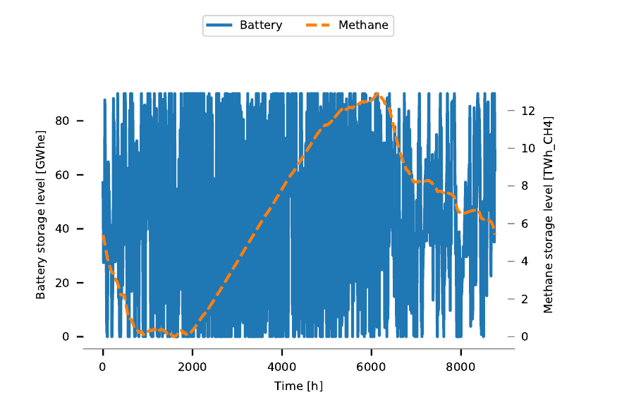
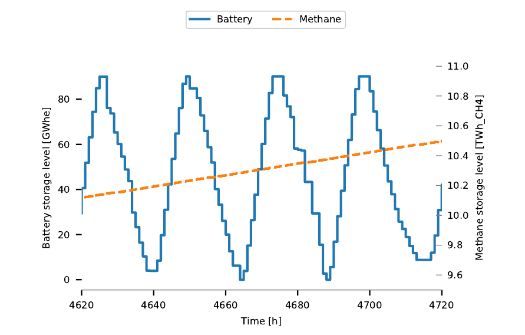
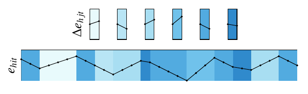

## TODO list
This is all assuming I've got this to work.
* Add python environment setup
* Add SpinePeriods to the Spine Julia Registry once release is done (Manuel).
* Set up a proper `init.jl` file, i.e., specifying git commits and or versions (not necessary for Toolbox, just specify in README).
* Finish for use of the demo.

SpinePeriods Demo
------------------

This is an example of how to use `SpinePeriods.jl` in conjunction with `SpineOpt.jl` to optimize the operation of a battery storage unit for a year. Computational speed up is achieved by limiting dispatch decisions to only 12 representative days, while the state of charge is defined for the whole year. This is of course more interesting for an investment rather than an operational problem.

Requirements
------------

* Spine Toolbox v0.5.36 or later (see https://github.com/Spine-project/Spine-Toolbox)
* Julia 1.5 or later (see https://julialang.org/)

Concept
-------

Investment models typically model a reduced set of time slices (or operation points) to achieve computational speedups or keep the problem tractable. Instead of optimising over a full year of 8760 hours, a set of representative hours, days, weeks or months may be used, with a typical choice being between 5 - 50 days. 

However, the value of long term storage, such as large scale pumped hydro or power to gas, may not be fully captured when using representative days, as these typically arbitrage over an entire year. The figure below illustrates this (source[https://lirias.kuleuven.be/retrieve/531420]).

One way of integrating long term storage while using representative days (which works reasonable well) is to map the charging and discharging variables on representative days to non-representative days. The state of charge is then defined for the entire year and its evolution is determined by the charging and discharging variables which are also defined for the entire year thanks to the mapping.

The figure below illustrates this graphically for the case where a representative period has a single time slice and there are 30 periods in the year, 6 of which are representative ([source](https://www.mech.kuleuven.be/en/tme/research/energy-systems-integration-modeling/pdf-publications/wp-esim2021-1)).

The purpose of `SpinePeriods.jl` is to create such a mapping which is then used by `SpineOpt.jl` in a similar fashion to the above figure. For further information, see [SpinePeriods.jl](https://github.com/Spine-project/SpinePeriods.jl) and the [SpineOpt.jl documentation](https://spine-project.github.io/SpineOpt.jl/latest/advanced_concepts/representative_days_w_seasonal_storage/).

Getting started
---------------

1\. Download or clone the files to your computer, e.g.:

    > git clone git@github.com:Spine-project/Spine-Periods-Demo.git

   (The recommended folder is the folder you store your spine projects in, but can be anywhere, for example your desktop.)

2\. Change the current directory to spine project "spine-periods-demo":

    > cd Spine-Periods-Demo
	
3\. Install required Python packages:
	
	> NOT DONE YET

4\. Install required Julia packages:

    > julia init.jl
    
5\. Run the demo:

    > julia run_demo.jl

6\. Open SpineToolbox:

    > python -m spinetoolbox

7\. Open project "spine-project-demo": 

   `File --> Open Project... --> spine-project-demo`

8\. Open the results of the optimisation by double clicking on `Opt output`

9\. You can inspect e.g. the battery state of charge by clicking on ...
